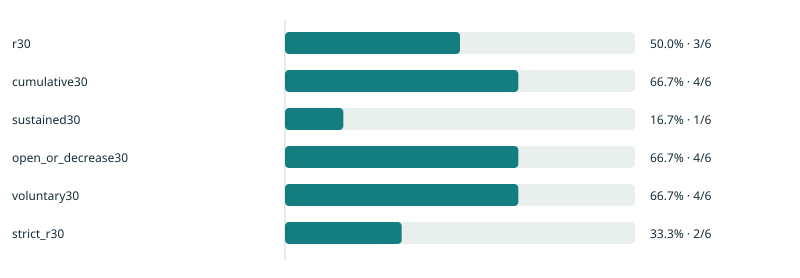

# IncentiveScope

**After the rebates: who keeps trading?**

A reproducible SQL/Python pipeline for studying DeFi incentive programs through fixed-cohort repeat participation. First case: GMX V2 perpetual trading on Arbitrum.

**Status: working v0.1 pipeline. The included dashboard is synthetic, not GMX research findings.** Real 2024 indexed executions can be fetched without a wallet or API key. The precise STIP earning boundaries, full historical coverage and address-level reward allocations must be verified before publishing final results.

## Run the complete offline example

Use **PowerShell 7** and Python 3.11 or newer:

```powershell
git clone https://github.com/ho2006/IncentiveScope.git
Set-Location IncentiveScope
python -m venv .venv
& .\.venv\Scripts\python.exe -m pip install -e .
& .\.venv\Scripts\python.exe checks.py
& .\.venv\Scripts\python.exe -m incentivescope analyze --config configs/demo.json --input data/sample/trades.csv --manifest data/sample/manifest.json --output reports/demo
Start-Process .\reports\demo\index.html
```

The example deliberately includes non-returners, late entry, a closing-only return, a liquidation, and a limit order created before the campaign ended. Its six cohort addresses and 50% R30 are software checks, **not estimates of actual GMX retention**.



Browse [the generated research note](reports/demo/research.md), [metric JSON](reports/demo/results.json), or the downloadable `reports/demo/index.html` dashboard. The HTML works offline without a server, JavaScript dependencies or external assets. A native filter explores observed-history groups; chart denominators remain fixed.

## Fetch real GMX executions

Start with one historical day to check coverage and volume:

```powershell
& .\.venv\Scripts\python.exe -m incentivescope fetch --config configs/gmx-stip.json --start 2024-03-29T00:00:00Z --end 2024-03-30T00:00:00Z --output data/raw/smoke
```

For a bounded probe add `--max-pages 1`. A capped extraction is marked incomplete until the adapter sees a terminal empty page. Analyze refuses incomplete extractions and insufficient post-campaign coverage. A one-day extraction is a source check, not enough data for retention.

After checking the scope, fetch the configured historical interval:

```powershell
& .\.venv\Scripts\python.exe -m incentivescope fetch --config configs/gmx-stip.json --output data/raw/gmx-stip
& .\.venv\Scripts\python.exe -m incentivescope analyze --config configs/gmx-stip.json --input data/raw/gmx-stip/trades.csv --manifest data/raw/gmx-stip/manifest.json --output reports/live --exploratory
```

`--exploratory` is necessary while `configs/gmx-stip.json` has provisional earning boundaries. Every real exploratory report displays that warning. Do not change the status to verified merely to remove the warning: document the final earning epoch and reconcile the source conflict first.

Acquisition uses the [GMX official Subsquid GraphQL surface](https://docs.gmx.io/docs/api/graphql/), unique-ID keyset pagination, finite retries and immutable request caches. Re-running the same extraction reuses its raw cache; use a new output directory for a fresh source snapshot. Interrupted runs reuse completed response pages. Raw data and live reports are Git-ignored.

Only successful `OrderExecuted` perpetual types 2–7 are normalized. Protocol `account` owns the activity, not the execution sender. Type 7 (liquidation/ADL) does not count as voluntary participation. USD size is converted from the protocol's 30-decimal raw integer; token-denominated fees remain **missing** rather than being treated as USD. Order creation is looked up separately; missing creation records stay unknown.

## What is measured

| Measure | Fixed-cohort definition |
| --- | --- |
| R30 | At least one successful positive-size opening/increase during post days 24–30 |
| Cumulative30 | At least one such execution during the first 30 complete post days |
| Sustained30 | Opening/increase on at least two distinct UTC days in the R30 window |
| Voluntary30 | Opening/increase or ordinary voluntary decrease during the R30 window |
| Strict R30 | R30 with an order created after earning ended; withheld if relevant timestamps are missing |
| R60 | Return during days 54–60; withheld without complete follow-up |

The earning interval is `[S,E)`. If E is not midnight, follow-up begins at the next complete UTC day. All non-returning addresses remain in the denominator. First-observed addresses are not claimed to be new people or newly acquired users. Volume, collateral and LP TVL are not treated as interchangeable retention measures.

Three sensitivity cuts are included: entry week/history, top-1% campaign-volume exclusion, and alternative activity definitions. Mature addresses use equal 30-day pre/post intensity windows. Reward unit costs stay unavailable without reconciled address-level earning-epoch allocations. These are historical observational comparisons, not causal CAC or ROI.

## Reproduction and evidence

Every input has explicit synthetic status, coverage, completion, row count and SHA-256. Missing or partial data fails closed. The pipeline exports one shared `results.json`, address cohorts, address-day data, five SVG figures and an HTML/Markdown research note. Amount strings are preserved in CSV; ranking uses floating-point USD size, and supplied USD position fees use 12 decimal places.

`checks.py` runs standard-library checks for windows, fixed denominators, old orders, liquidation exclusions, missing fields, invalid amounts, incomplete coverage, duplicate events, pagination, provenance and HTML escaping. GitHub Actions uses PowerShell on Windows.

Source and campaign caveats: [campaign notes](docs/campaign.md). Complete original design: [project plan](docs/PLAN.md).

The one-day [live source check](docs/live-smoke.json) recorded 5,902 normalized execution rows and 1,705 protocol accounts, with complete pagination for that query. This is an acquisition check, not a retention estimate or an independent proof of indexer completeness.

## Notebook companion

[research.ipynb](notebooks/research.ipynb) reruns the synthetic analysis using the same SQL and report functions, preserves the input checksum, and contains saved SVG outputs. It adds no separate metric implementation. Optional notebook tooling is separate from the core DuckDB dependency:

```powershell
& .\.venv\Scripts\python.exe -m pip install -e '.[notebook]'
& .\.venv\Scripts\python.exe scripts/execute_notebook.py
```

## Next research gates

1. Reconcile the first and final trading-rebate earning epochs, distinct from payment days.
2. Acquire the complete cohort/follow-up range; independently check account attribution and representative days.
3. Reconcile reward allocations and obtain independently specified fee data before adding cost/fee findings.
4. Write evidence-based English conclusions from the verified real snapshot.

Code and the deliberately synthetic examples are MIT licensed. GMX indexed data and referenced materials retain their source terms; no ownership over third-party data is claimed.
