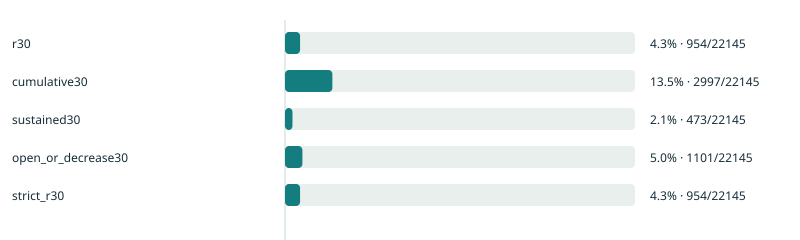
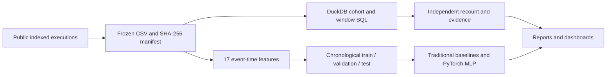

# IncentiveScope

**After trading rebates end, who keeps participating - and can past behavior predict who returns?**

An open-source research portfolio connecting on-chain event interpretation, SQL/Python analysis and a PyTorch time backtest. The historical case studies GMX V2 perpetual trading on Arbitrum after its first STIP trading-rebate program, using 907,107 indexed executions from 2023-2024.

[](https://github.com/ho2006/IncentiveScope/actions/workflows/checks.yml)

## Start here

| Your goal | Entry point |
| --- | --- |
| Read the complete English research story | [Web report](https://ho2006.github.io/IncentiveScope/portfolio/) · [PDF](https://ho2006.github.io/IncentiveScope/portfolio/research.pdf) · [Markdown source](docs/portfolio-report.md) |
| Explore definitions, cohorts and sensitivity | [Participation dashboard](https://ho2006.github.io/IncentiveScope/) |
| Review the PyTorch experiment and baselines | [Prediction dashboard](https://ho2006.github.io/IncentiveScope/ml/) · [ML notebook](notebooks/retention-ml.ipynb) |
| Reproduce from frozen data | [PowerShell 7 runbook](docs/reproduction.md) · [Input release](https://github.com/ho2006/IncentiveScope/releases/tag/v0.2.0) |
| Present or include the project in an application | [3-minute / 5-minute demo](docs/interview.md) · [English application copy](docs/application.md) |

The reports and figures work without credentials. Offline, open `reports/gmx-stip/portfolio/index.html`, `reports/gmx-stip/index.html` or `reports/gmx-stip/ml/index.html` from a clone. The descriptive notebook is [here](notebooks/gmx-stip.ipynb); saved notebooks inspect committed results by default and provide explicit recomputation modes.

## What the case finds

- **Late participation differs from any revisit.** Among 22,145 campaign opening accounts, R30 is **954 / 22,145 = 4.31%**, compared with **13.53%** cumulative 30-day return and **2.14%** participation on at least two R30 dates. R30 is an opening/increase in `[2024-04-19, 2024-04-26)` UTC.
- **Prediction adds ranking information, with no neural-network win.** The primary MLP's test AP is **0.3387**, compared with **0.3412** for logistic regression and **0.3403** for gradient boosting. Its top 2,215 scores capture **565 / 954 returns (59.22%)**, with **5.92x lift**. Mean predicted probability is 6.48%, versus 4.31% observed participation.
- **Definitions and attribution change the conclusions.** Previously observed addresses have 8.62% R30 versus 3.35% for first-observed campaign addresses. Excluding the largest 1% by campaign opening size gives 4.12%. These are bounded address-history comparisons, not acquired people or incentive causal effects.



## How the project is built



| Area | Inspectable implementation |
| --- | --- |
| Acquisition and contracts | [Extractor](src/incentivescope/fetch.py), [normalized input rules](src/incentivescope/common.py), [campaign boundaries](docs/boundary-evidence.md) |
| Descriptive analysis | [Metric SQL](src/incentivescope/metrics.sql), [analyzer](src/incentivescope/analyze.py), [daily quality / independent recount](docs/data-quality.md) |
| Prediction | [Feature construction](src/incentivescope/ml_data.py), [training / evaluation](src/incentivescope/ml_models.py), [fixed configuration](configs/gmx-stip-ml.json), [methods](docs/ml.md) |
| Reproducibility | [CPU dependency lock](requirements-ml-cpu.txt), [one-command rehearsal](scripts/rehearse.ps1), [comparison verifier](scripts/verify_reproduction.py), [tests](tests), [CI](.github/workflows/checks.yml) |
| Communication | [Integrated English report](docs/portfolio-report.md), [model metrics / predictions / weights](reports/gmx-stip/ml), [portfolio renderer](scripts/build_portfolio.py) |

## Run locally

Use **PowerShell 7** and native Git. The core package needs only DuckDB and supports Python 3.11+. The published CPU ML environment uses Python 3.14.4 and PyTorch 2.14.1+cpu.

```powershell
git clone https://github.com/ho2006/IncentiveScope.git
Set-Location IncentiveScope
py -3.14 -m venv .venv
& ./.venv/Scripts/python.exe -m pip install -e .
& ./.venv/Scripts/python.exe checks.py
```

For the full frozen-input rebuild, independent ML environment, notebook execution and artifact comparison:

```powershell
# PowerShell 7.4+; run in a fresh clone, with Python 3.14 installed.
& ./scripts/rehearse.ps1
```

The rehearsal downloads about 124 MB of compressed historical input plus Python dependencies; generated outputs remain under ignored `reports/live/reproduction`. It installs a built wheel, retrains on CPU and compares the analytical outputs with the published references. Download caches may be reused. The [runbook](docs/reproduction.md) explains manual steps, the recorded outcome and comparison tolerances. Core-only environments skip optional ML model/report checks; CI runs a separate CPU ML job before publishing Pages.

## Research boundaries

This is one historical campaign and one final holdout. Training/validation occur during rebates; final labels occur after they end. The study does not estimate incremental acquisition, causal incentive impact, CAC or ROI. Address histories are truncated and other campaigns overlap the observation periods.

Five selected receipts validate account/type/size/fee semantics, rather than the full indexed population. Dune SQL is source-reviewed and **unexecuted**, with no claimed cross-source agreement. Voluntary decrease participation is withheld because a secondary ADL marker is missing. Official reward files reconcile 19 epochs and about 4.98 million ARB in **allocations**, not verified transfers; receiver overrides prevent complete original-trader cost attribution.

[Event checks](docs/event-validation.md) · [Reward attribution](docs/reward-data.md) · [Dune status](docs/dune.md) · [Campaign context](docs/campaign.md) · [Completion history](docs/completion.md)

## License

Code and synthetic examples are MIT licensed. Indexed data, official distribution artifacts and referenced materials retain their original terms and provenance. The frozen input release redistributes a normalized historical extract with its source manifest.
