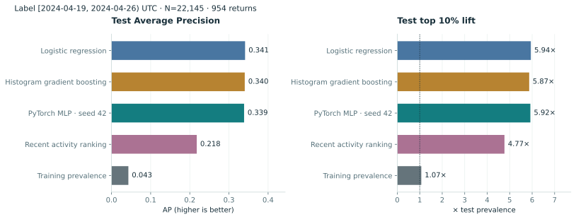
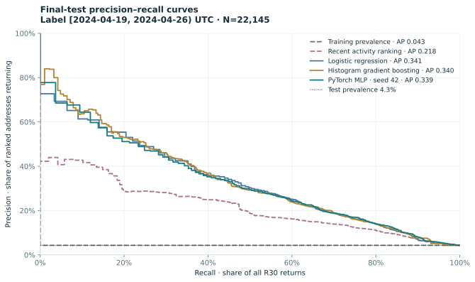
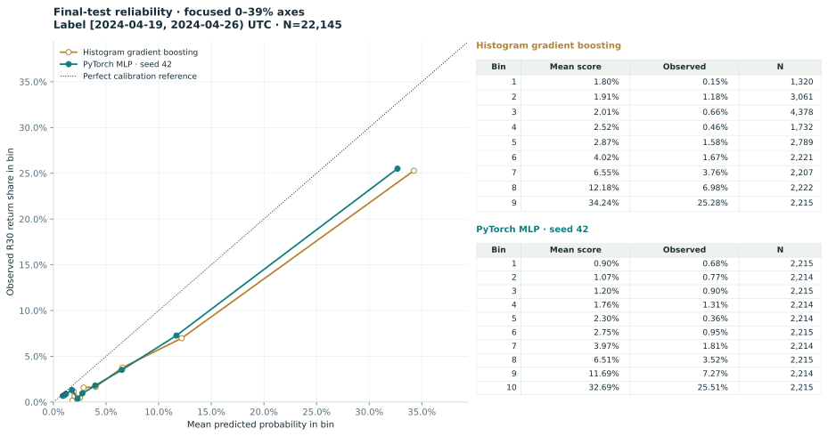
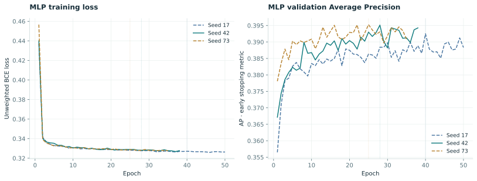
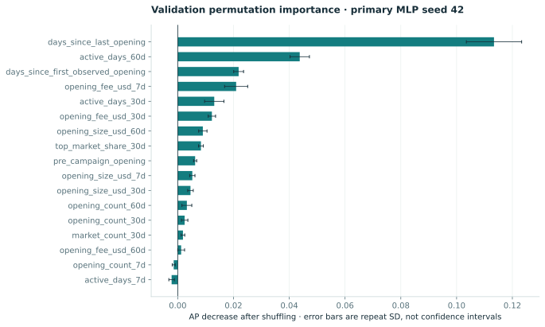

# IncentiveScope: predicting R30 participation

HISTORICAL TIME-HOLDOUT RESEARCH · ONE CAMPAIGN

The final test contains 22,145 addresses and 954 R30 returns (4.3%).

Primary MLP test AP is 0.3387; Histogram gradient boosting, the strongest baseline by validation AP, has test AP 0.3403.

The MLP top 10% ranking captures 59.2% of returns, with precision 25.5% and lift 5.921× over test prevalence.

Model selection used validation AP and selected PyTorch MLP · seed 42. MLP seed 42 was designated before final test evaluation; all three seeds are reported.

## Model comparison

| Model | Validation AP | Test positives / N | Test AP | Top 10% lift | Brier |
|---|---:|---:|---:|---:|---:|
| Training prevalence | 0.09607 | 954/22,145 | 0.04308 | 1.069 | 0.05052 |
| Recent activity ranking | 0.272 | 954/22,145 | 0.2177 | 4.768 | N/A |
| Logistic regression | 0.3874 | 954/22,145 | 0.3412 | 5.942 | 0.03435 |
| Histogram gradient boosting | 0.3877 | 954/22,145 | 0.3403 | 5.869 | 0.03508 |
| PyTorch MLP · seed 42 | 0.3951 | 954/22,145 | 0.3387 | 5.921 | 0.03476 |

## Figures

## Methods

At cutoff T, eligible accounts have already opened during [earning start, T). Every feature uses timestamp < T; the label is an opening in [T+23 days, T+30 days). Training-only log1p/scaling, validation-only model selection and early stopping, and a fixed primary MLP seed 42 prevent final-test tuning. Validation examples are never added back to parameter training.

| Use | Cutoff UTC | Label start | Label end (exclusive) | Samples | Returns |
|---|---|---|---|---:|---:|
| train | 2023-11-22T00:00:00Z | 2023-12-15T00:00:00Z | 2023-12-22T00:00:00Z | 2,197 | 560 |
| train | 2023-12-06T00:00:00Z | 2023-12-29T00:00:00Z | 2024-01-05T00:00:00Z | 4,457 | 907 |
| train | 2023-12-20T00:00:00Z | 2024-01-12T00:00:00Z | 2024-01-19T00:00:00Z | 6,255 | 997 |
| train | 2024-01-03T00:00:00Z | 2024-01-26T00:00:00Z | 2024-02-02T00:00:00Z | 8,095 | 830 |
| train | 2024-01-17T00:00:00Z | 2024-02-09T00:00:00Z | 2024-02-16T00:00:00Z | 11,363 | 1,221 |
| validation | 2024-02-21T00:00:00Z | 2024-03-15T00:00:00Z | 2024-03-22T00:00:00Z | 16,634 | 1,598 |
| test | 2024-03-27T00:00:00Z | 2024-04-19T00:00:00Z | 2024-04-26T00:00:00Z | 22,145 | 954 |

## Feature dictionary

- `opening_count_7d`: Opening/increase execution count, preceding 7 days; zero if no activity.
- `active_days_7d`: Distinct active UTC days, preceding 7 days; zero if no activity.
- `opening_size_usd_7d`: Sum of opening/increase size, USD, preceding 7 days; zero if no activity.
- `opening_fee_usd_7d`: Net opening position fees after trader discount, USD, preceding 7 days; zero if no activity.
- `opening_count_30d`: Opening/increase execution count, preceding 30 days; zero if no activity.
- `active_days_30d`: Distinct active UTC days, preceding 30 days; zero if no activity.
- `opening_size_usd_30d`: Sum of opening/increase size, USD, preceding 30 days; zero if no activity.
- `opening_fee_usd_30d`: Net opening position fees after trader discount, USD, preceding 30 days; zero if no activity.
- `opening_count_60d`: Opening/increase execution count, preceding 60 days; zero if no activity.
- `active_days_60d`: Distinct active UTC days, preceding 60 days; zero if no activity.
- `opening_size_usd_60d`: Sum of opening/increase size, USD, preceding 60 days; zero if no activity.
- `opening_fee_usd_60d`: Net opening position fees after trader discount, USD, preceding 60 days; zero if no activity.
- `days_since_first_observed_opening`: Days from first observed opening to cutoff; extract-bounded history.
- `days_since_last_opening`: Days from latest observed opening to cutoff.
- `pre_campaign_opening`: 1 if an opening was observed before the earning window, else 0.
- `market_count_30d`: Distinct markets with openings in the preceding 30 days.
- `top_market_share_30d`: Largest market&#x27;s share of opening USD size in the preceding 30 days; zero without openings.

## Source and interpretation limits

Frozen input SHA-256: `76e4992debf0bf2e60328221c94c840aa97c2c7545550085bcd3e83d09fe61a3`.

- This is one historical campaign and one final time holdout; it is not evidence of generalisation across protocols or campaigns.
- Training and validation labels occur while rebates are active. The final test label occurs after rebates end; prevalence and behaviour can shift.
- Repeated addresses occur at different training cutoffs. The final test separately reports addresses present and absent from parameter training.
- Addresses are not people. Keeper senders are not trader accounts; several addresses may belong to one entity.
- The label is a positive-size successful opening or increase in [T + 23 days, T + 30 days), not any return within 30 days.
- Predictions and permutation importance describe associations. They do not estimate the causal effect of incentives or justify targeting interventions.
- Scores are not additionally calibrated. Reliability plots show any probability bias; recency provides ranking scores only.
- Indexed coverage starts on 2023-09-20. First observed opening and pre-campaign history are bounded by this extract, not lifetime history.
- This event-time backtest uses a later frozen indexer snapshot. Historical point-in-time index availability and subsequent corrections were not audited.
- Dune execution and independent cross-source agreement have not been established by this ML study.

Full settings, split-specific metrics, probability bins, seed histories and versions are in [results.json](results.json).
